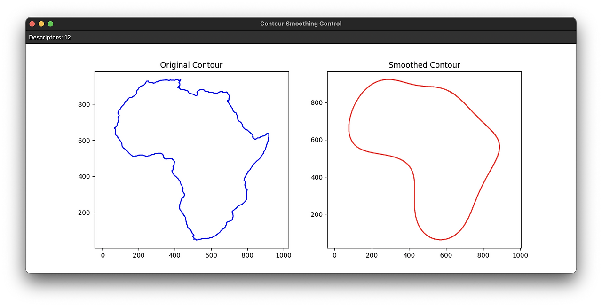
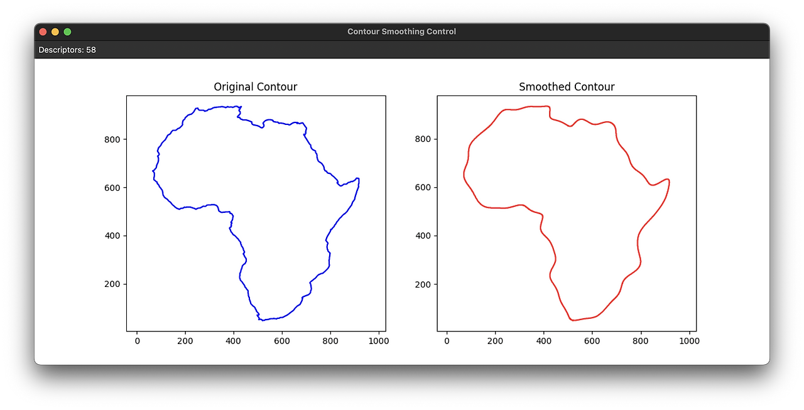

# Realtime Contour Smoothing using Fourier Descriptor

This application demonstrates real-time contour smoothing using Fourier descriptors with an interactive GUI built with Tkinter and Matplotlib.

## Example Results




## Overview

The application transforms contours of binary images into the frequency domain using Fast Fourier Transform (FFT) and allows interactive filtering of the frequency components. By adjusting the number of Fourier descriptors retained, users can control the smoothness of the contour in real-time.

## Features

- Interactive GUI with real-time visualization
- Side-by-side display of original and smoothed contours
- Mouse-controlled adjustment of smoothing level
- Fourier descriptor-based contour filtering

## How It Works

1. The application loads an image and extracts the largest contour
2. The contour is converted into a complex signal (x coordinates as real part, y coordinates as imaginary part)
3. Fast Fourier Transform (FFT) is applied to the complex contour
4. User interactively controls how many descriptors to retain
5. Inverse FFT is applied to reconstruct the smoothed contour
6. Both original and smoothed contours are displayed in real-time

## Mathematical Background

Fourier descriptors are powerful tools for shape analysis and representation. The main steps are:

1. **Contour Representation**: Convert contour points to complex numbers: `z(t) = x(t) + j*y(t)`
2. **Fourier Transform**: Apply FFT to get frequency components: `Z(k) = FFT(z(t))`
3. **Filtering**: Retain only the first N descriptors (low-frequency components)
4. **Reconstruction**: Apply inverse FFT to get smoothed contour: `z'(t) = IFFT(Z'(k))`

## Requirements

- Python 3.x
- OpenCV
- NumPy
- Matplotlib
- Tkinter

## Installation

```bash
pip install opencv-python numpy matplotlib
```

## Usage

1. Update the `image_path` variable in the code to point to your binary image
2. Run the script:

```bash
python contour_smoothing.py
```

3. Move your mouse horizontally across the plot to adjust the number of Fourier descriptors
4. The left plot shows the original contour, while the right plot displays the smoothed version

## Applications

- Shape analysis and recognition
- Noise removal from contours
- Feature extraction in computer vision
- Educational tool for understanding Fourier transforms in image processing

## License

MIT

## Author

@bemoregt
